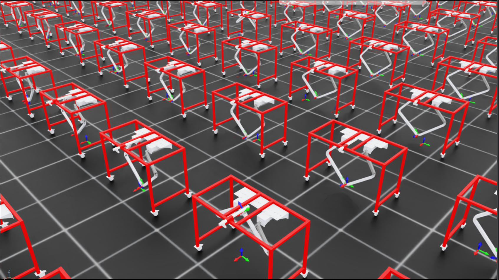

# volcaniarm_isaaclab

Isaac Lab training environment for the Volcaniarm, a 2-DOF delta type robotic
arm for precision weeding in agriculture, as part of my Thesis. Policy learns
inverse kinematics via RL (no analytical IK).

<p align="center">
  
</p>

### Related repos
- ROS 2 workspace: [volcaniarm_ws](https://github.com/LevinTamir/volcaniarm_ws)
- Firmware: [volcaniarm_firmware](https://github.com/LevinTamir/volcaniarm_firmware)

## Layout

```
assets/
├── urdf/                  # URDF + STL meshes (source of truth for USD)
└── usd/                   # GITIGNORED — regenerated from URDF
scripts/
├── convert_urdf.py        # URDF → base USD (instanceable meshes)
├── close_loop.py          # base USD + closure_joint overlay → closed USD
├── add_ros2_graph.py      # closed USD + ROS2 graph/camera/ground/light → ros2 USD
└── build_lab.py           # ros2 USD + workshop visuals → lab USD
source/                    # IsaacLab external-project package (TBD)
```

## USD chain

Each script writes a sublayer overlay on top of the previous USD, so all four
files stay in sync from one source of truth (the URDF):

| File                       | Built by              | Used for                                     |
| -------------------------- | --------------------- | -------------------------------------------- |
| `volcaniarm.usd`           | `convert_urdf.py`     | base articulation (open kinematic tree)      |
| `volcaniarm_closed.usd`    | `close_loop.py`       | **IsaacLab training** (5-bar loop closed)    |
| `volcaniarm_ros2.usd`      | `add_ros2_graph.py`   | ROS2 demo in Isaac Sim (joint + camera I/O)  |
| `volcaniarm_lab.usd`       | `build_lab.py`        | ROS2 demo with workshop room visuals         |

The `_ros2` overlay adds a ground plane, dome light, RealSense-style camera on
`/volcaniarm/camera_link`, and an OmniGraph that publishes `/clock`,
`/joint_states`, `/camera/color/image_raw`, `/camera/color/camera_info`,
`/camera/depth/color/points` and subscribes `/joint_commands`.

The `_lab` overlay is a pure visual overlay (no physics, no graph edits) that
adds an 8x8 m room, workbench, desk, stool, and potted plant matching the
Gazebo `lab.sdf` pose used in [`volcaniarm_ws`](https://github.com/LevinTamir/volcaniarm_ws).

## Regenerating the USDs

The first three scripts run under IsaacLab's Python; `add_ros2_graph.py` must
run under Isaac Sim's bundled Python so its `rclpy` matches the ROS2 bridge.

```bash
# Training chain (IsaacLab env)
conda activate isaaclab_env
~/isaac/IsaacLab/isaaclab.sh -p scripts/convert_urdf.py
~/isaac/IsaacLab/isaaclab.sh -p scripts/close_loop.py

# ROS2 chain (Isaac Sim's bundled Python — deactivate conda first)
conda deactivate
~/isaac/isaac-sim/python.sh scripts/add_ros2_graph.py

# Lab visual overlay (back in IsaacLab env)
conda activate isaaclab_env
~/isaac/IsaacLab/isaaclab.sh -p scripts/build_lab.py
```

IsaacLab training loads `volcaniarm_closed.usd`. The ROS2 demo opens
`volcaniarm_ros2.usd` (or `volcaniarm_lab.usd` for the dressed scene) in the
Isaac Sim GUI and presses Play.

