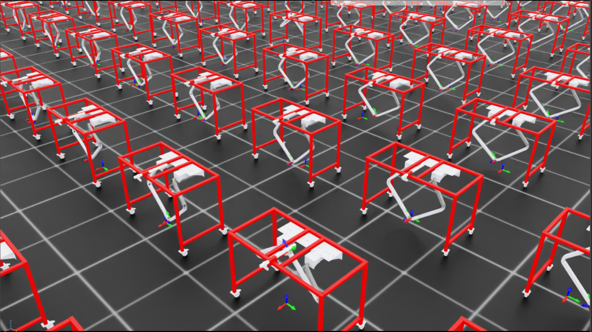

# volcaniarm_isaaclab

Isaac Lab training environment for the Volcaniarm, a 2-DOF delta type robotic
arm for precision weeding in agriculture, as part of my Thesis. Policy learns
inverse kinematics via RL (no analytical IK).

<p align="center">
  
</p>

### Related repos
- ROS 2 workspace: [volcaniarm_ws](https://github.com/LevinTamir/volcaniarm_ws)
- Firmware: [volcaniarm_firmware](https://github.com/LevinTamir/volcaniarm_firmware)

## Layout

```
assets/
├── urdf/                  # GENERATED by sync_urdf.py from volcaniarm_ws — do not hand-edit
└── usd/                   # GITIGNORED — regenerated from URDF
scripts/
├── sync_urdf.py           # ws xacro → Isaac URDF + mesh sync (plain python3)
├── convert_urdf.py        # URDF → base USD (instanceable meshes)
├── apply_materials.py     # base USD + real-robot PBR materials (in place)
├── close_loop.py          # base USD + closure_joint overlay → closed USD
├── add_ros2_graph.py      # closed USD + ROS2 graph/camera/ground/light → ros2 USD
└── build_lab.py           # ros2 USD + workshop visuals → lab USD
source/                    # IsaacLab external-project package (volcaniarm tasks)
```

The **canonical robot model** is `volcaniarm.urdf.xacro` in
[volcaniarm_ws](https://github.com/LevinTamir/volcaniarm_ws). Edit it there,
then regenerate the Isaac copy (needs a *built* ws so xacro resolves):

```bash
python3 scripts/sync_urdf.py            # regenerate assets/urdf + meshes
python3 scripts/sync_urdf.py --check    # CI-style staleness check (exit 1 if stale)
```

`sync_urdf.py` strips ROS/Gazebo-only content (`<gazebo>`, `<ros2_control>`,
the `world` link, RealSense TF frames, closure debug spheres), synthesizes the
`left_ee_link`/`right_ee_link` frames at the closure point, rewrites mesh
paths to absolute, and enforces the joint-order contract
`[left_elbow, left_arm, right_elbow, right_arm]`. Flat colors come from the
ws `materials.xacro` palette; `apply_materials.py` upgrades them to PBR on the
Isaac side (same base RGB — keep the two in sync).

## USD chain

Each script writes a sublayer overlay on top of the previous USD, so all four
files stay in sync from one source of truth (the URDF):

| File                       | Built by                                  | Used for                                     |
| -------------------------- | ----------------------------------------- | -------------------------------------------- |
| `volcaniarm.usd`           | `convert_urdf.py` + `apply_materials.py`  | base articulation (open tree, PBR materials) |
| `volcaniarm_closed.usd`    | `close_loop.py`                           | **IsaacLab training** (5-bar loop closed)    |
| `volcaniarm_ros2.usd`      | `add_ros2_graph.py`                       | ROS2 demo in Isaac Sim (joint + camera I/O)  |
| `volcaniarm_lab.usd`       | `build_lab.py`                            | ROS2 demo with workshop room visuals         |

The `_ros2` overlay adds a ground plane, dome light, D435i-matched camera on
`/volcaniarm/camera_link`, and an OmniGraph that publishes `/clock`,
`/isaac_joint_states`, `/camera/color/image_raw`, `/camera/color/camera_info`,
`/camera/aligned_depth_to_color/image_raw` and subscribes `/joint_commands`.
(`/camera/depth/color/points` is composed ROS-side by the shared
`depth_image_proc` pipeline in `volcaniarm_ws`.)

The `_lab` overlay is a pure visual overlay (no physics, no graph edits) that
adds the lab room, black rubber mat, and printed-weed prop matching the
Gazebo `lab.sdf` scene in [`volcaniarm_ws`](https://github.com/LevinTamir/volcaniarm_ws).

## Regenerating the USDs

The first three scripts run under IsaacLab's Python; `add_ros2_graph.py` must
run under Isaac Sim's bundled Python so its `rclpy` matches the ROS2 bridge.

```bash
# 0. Sync the URDF from the ws (plain python3, ws must be colcon-built)
python3 scripts/sync_urdf.py

# Training chain (IsaacLab env)
conda activate isaaclab_env
~/isaac/IsaacLab/isaaclab.sh -p scripts/convert_urdf.py
~/isaac/IsaacLab/isaaclab.sh -p scripts/apply_materials.py   # real-robot PBR — mandatory
~/isaac/IsaacLab/isaaclab.sh -p scripts/close_loop.py

# ROS2 chain (Isaac Sim's bundled Python — deactivate conda first)
conda deactivate
~/isaac/isaac-sim/python.sh scripts/add_ros2_graph.py

# Lab visual overlay (back in IsaacLab env)
conda activate isaaclab_env
~/isaac/IsaacLab/isaaclab.sh -p scripts/build_lab.py
```

IsaacLab training loads `volcaniarm_closed.usd`. The ROS2 demo opens
`volcaniarm_ros2.usd` (or `volcaniarm_lab.usd` for the dressed scene) in the
Isaac Sim GUI and presses Play.

## Deploying the trained policy

Training exports `policy.onnx` under `logs/rsl_rl/volcaniarm_reach/<run>/exported/`.
Copy it into `volcaniarm_ws` where the policy controller loads it from:

```bash
cp logs/rsl_rl/volcaniarm_reach/<run>/exported/policy.onnx \
   ../volcaniarm_ws/src/volcaniarm_controllers/models/policy.onnx
```

Rebuild the workspace and launch with the arg `controller:=policy`.


[](https://www.youtube.com/watch?v=4XY7dVNpVtU)

